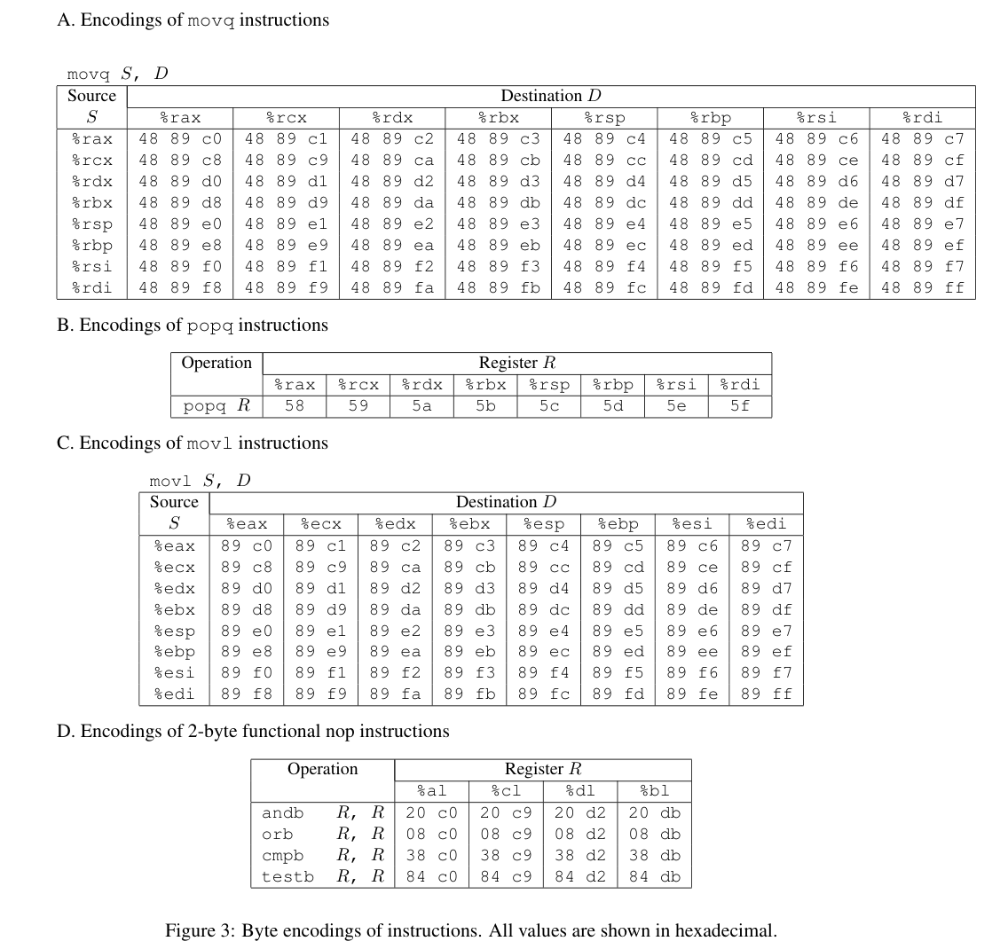

# csapp 缓冲区溢出攻击

[TOC]

[TIME:2024-12-19]
[TAG:assembly]

## 介绍
本文记录csapp实验题中[attack bomb](https://csapp.cs.cmu.edu/3e/labs.html)的分析过程;该实验要求利用程序的缓冲区溢出漏洞,通过给予特定输入内容,改变程序正常的运行逻辑，实现对程序的攻击操作;通过这个攻击过程可以加强对栈区数据机制的理解, 并对缓冲区溢出攻击有更直观的认识,日常写代码时也会从此格外注意。实验给了两个待攻击的目标程序, ctarget和rtarget,和对应共计5个攻击要求.感兴趣的话可以一起参考上面的链接下载实验程序进行一番探索（实验环境要求Linux系统，使用gdb进行调试)

## part I: ctarget
### phase 1
第一题首先介绍了ctarget程序的特点，它内部存在一个test函数，其调用getbuf函数来接收一个buf输入，我们需要让getbuf调用返回之后，不进行后续操作，直接调用程序内部的touch1函数。

gdb运行目标程序(ctarget),反汇编看下test和getbuf的实现。

从getbuf开始的反汇编中，看到rsp寄存器减去了0x28（40个字节），一般来说，应该是从栈上分配了40个字节的内存给局部变量，对应代码中的BUFFERSIZE，之后将rsp赋值给rdi，作为Gets的参数来接收数据。
之后我还看了下Gets的反汇编，但是想了想，Gets本身的作用是读取数据存储到buf，要想实现getbuf返回之后不继续执行原有逻辑，则需要在Gets读取的时候，让溢出数据覆盖栈上get\_buf的返回地址，通过改变返回地址，改变ip寄存器的行为。和Gets本身的逻辑应该关系不大.
观察调用getbuf时的栈数据，发现进入函数入口时rsp指针为 0x5561dca0，

此时它对应栈上的数据是0x00401976,正是getbuf返回后的下一行地址。此处如果能让getbuf里缓存溢出修改当前这里的数据，就可以使得getbuf返回后跳转到touch1. 测试输入12345,发现0x5561dca0-0x28的位置，确实被修改成了12345（对应下图中的0x31 0x32 0x33 0x34 0x35）；现在问题转化为，要把touch1的函数地址，作为给getbuf的输入中的第41-44个byte的数据;

disas touch1获取到函数开始地址后(具体小端序表示为c0 17 40 00)，使用hex2raw 进行验证，发现确实通过了level1测试,验证成功。


### phase 2
第二题增加了难度，具体如下,


现在要求getbuf返回后跳转到touch2，且这个touch2存在一个unsigned的参数，一开始我想着很简单，以为把这里要求的cookie（一个unsigned数）作为rsp+4地址的数据写入(即追加到ret地址之后)，就可以作为调用touch2时的第一个外部参数被读取，然而验证失败了.

阅读手册中的建议，发现这里实际touch2的第一个参数是通过rdi寄存器传递的，而不是通过rsp+4的栈数据传递；需要在getbuf返回的时候，将rdi寄存器设置为对应的cookie；问题来了，怎么通过栈溢出来修改rdi寄存器的值呢？让程序能完全按照这种极具自定义属性的逻辑运行，感觉可以通过缓冲区溢出，在栈的内存区域传递一段代码（包含给rdi赋值的逻辑）,然后在getbuf返回的时候，直接跳转到栈上我们代码的位置。不过对于这个办法来说，可能存在一个问题，就是栈区上传递A的数据可能不可执行,尝试验证试试。


直接把栈的数据地址作为ret返回的地址，ret执行时直接触发了段错误，程序异常中断了。

苦思良久,不得其法。开始在网上找，发现一般防止栈溢出攻击，一个有力的措施就是让栈不可执行。找了一个其他人attack lab的分析，发现他level2的想法和我没什么区别。但是我的程序会崩溃（signal 11）,应该还是我这边环境的原因；网上找[怎么解决栈不可执行](),发现可以通过安装execstack 程序来检查栈执行状态并修改。

```shell
# 修改为栈可执行
execstack -s ./ctarget
```

检查发现ctarget确实是栈不可执行的，调整之后发现不再出现之前的段错误(signal 11),但是还是会在ret的时候段错误崩溃（和之前不一样,没有11的错误码）.目前我的注入代码部分，是把修改rdi寄存器的逻辑放在栈上40个byte的buffer之外，在返回地址的区域之后，加上了汇编的指令；40 byte数据+ret地址+注入代码(其中ret地址指向栈上注入代码的起始位置)，反复检查并调试了逻辑，直到ret执行（崩溃之前）感觉都没什么问题。但是问题依旧，还是崩溃，我甚至怀疑是不是我的汇编写的有问题，又确认了一遍手册中给的生成汇编的机械码的方法。

之后我又尝试直接把注入代码放到40个byte buffer的位置上，把ret地址改成buffer的栈位置,此时，发现通过了测试。


很纳闷为啥必须放在这个buffer里，追加到ret地址之后到底有什么问题呢？ 于是继续删减调试ret地址之后的汇编部分，然后让我发现一个很奇怪的崩溃堆栈，堆栈里执行的函数地址是我修改后的，但是发现它有8个字节；由于调试时显示的地址都是4个字节就存储完了，让我遗漏了这一点(ret的时候pop到rip寄存器，会pop出来8个字节的地址数据)。


我把ret地址后面加4个00 补齐，之后再追加注入代码，确实也可以通过测试了！


然后，放在40byte的buffer里就正常，是因为这个时候传入的缓冲区数据，最后就是ret地址，它之后的数据碰巧是4个0(如果手动改成非0也一样会出现崩溃问题).简单来说，之前遇到的崩溃，是由于ret返回的地址，是个被认为不可正常访问的地址（没有补0引起）。


### phase 3
第三题要求getbuf返回之后调用touch3函数，这个函数需要传入一个字符串（cookie值对应的字符）参数。逻辑跟level2很类似，只是这里需要把字符串数据也写入到栈上，并把起始地址赋值给rdi（调用参数）即可。
需要注入的汇编逻辑如下：
``` assembly
Disassembly of section .text:

0000000000000000 <.text>:
   0:   6a 00                   push   $0x0       # 栈地址向下增长，这里先push 0作为字符串的结尾
   2:   48 b8 35 39 62 39 39    movabs $0x6166373939623935,%rax  # 把cookie值0x59b997fa对应的8个字符赋值给rax,这里顺序是颠倒的（小端序）
   9:   37 66 61
   c:   50                      push   %rax        # 入栈
   d:   48 89 e7                mov    %rsp,%rdi   # 将当前的栈指针(即cookie字符串的起点)赋值给rdi作为参数
  10:   68 fa 18 40 00          push   $0x4018fa   # push touch3函数的起始地址
  15:   c3                      ret                # 跳转到touch3
```


## part 2: rtarget
第二部分需要通过代码注入攻击rtarget程序;这一部分里面，手册明确说明了rtarget会随机化栈区地址，且栈区不可执行，所以使用part 1中的攻击手段会失效。
### phase 4
栈上不能存储代码来运行，怎么搞呢？手册里介绍了一种新的思路:面向return编程. 它基于两点：
- 缓冲区溢出，栈上的地址可以被我们覆盖，我们可以控制其往任意的地址上跳转
- 程序指令的机械码，如果从不同的位置开始解释,可以解释成不同含义的汇编指令,这些特定指令如果是以ret结束，则可以继续借助栈上的ret地址，跳转到下一个机械码片段上。


当跳转到特定代码位置时，即可执行我们期望的指令操作，之后再ret到下一个位置，如此连续结合多条指令，即可执行一段复杂的逻辑。非常有趣，只能说攻击者的脑子真好使~



之后手册提示了可以在特定区域内(start\_farm函数和mid\_farm函数之间)找到我们需要的跳转位置，我们需要进行的操作其实和phase2中是类似的，需要把cookie值赋值给rdi，然后ret到touch2函数的位置上就可以；对照提供的汇编指令表，一番查找后发现了端倪:


找到需要跳转的位置后，直接修改栈上数据即可，一番调整后通过了，具体如下：


### phase 5
这一题需要做的和phase3类似,需要跳转到touch3，同时确保rdi指向一个字符串的地址; 需要使用程序中已有的逻辑组合，通过ret来串联已有的逻辑代码片段，实现我们需要的行为。手册提示可以使用start\_farm到end\_farm之间的所有片段。先理一下需要的操作, 栈上可以直接覆盖存上我们需要的字符串，这样就不需要像phase3里那样在执行逻辑中去赋值。具体操作如下

- 将cookie字符串存储到栈上的高位上（可以假定覆盖缓冲区的最后部分即是字符串）
- 需要把rsp地址赋值给rdi，作为touch3函数的参数

对照指令表和farm区域中的代码片段，发现了一个可以用的片段，这里没有找到mov rsp，rdi的，只有mov rsp，rax；但是借助phase4中已知的mov rax，rdi，即可实现对rdi的赋值。

但实际操作的时候发现，存储的字符串地址，相对于rsp取值时会有一个偏移，mov rsp rdi时赋值的rdi，需要加上一个偏移才能指向实际的字符串,不然如果只是当前的rsp指向字符串，则这段代码ret的时候，会把字符串的内容作为地址ret，就会造成逻辑错误;继续观察指令对照表，发现仅靠mov和pop操作，应该根本构造不出来这个偏移.

重新看start\_farm和end\_farm之间的反汇编逻辑，不看不知道，一看发现了华点。

有个这个lea的助力，我们就只需看现有的汇编机械码中能否找出来指令，通过mov和pop让rdi和rsi变成我们期望的值。一番检索对照，发现确实可以满足条件，对应的汇编和指令如下


``` assembly
# 将rsp赋值给rdi
mov %rsp,%rax (48 89 e0)
mov %rax,%rdi (48 89 c7)

# 事先在栈上写入偏移值，pop给rax，之后逐步赋值给rdi
pop %rax  (58)
mov %eax,%edx (89 c2)
mov %edx,%ecx (89 d1)
mov %ecx,%esi (89 ce)

# rdi+rsi+1 赋值给rdi
lea (%rdi,%rsi,1),%rax
mov %rax,%rdi (48 89 c7)

```


上面的汇编省略了ret指令，把对应的代码片段地址放入栈上，整体放上之后，可知如果把字符串放在最后，pop rax时需要赋值的偏移为0x48,验证通过了测试。


