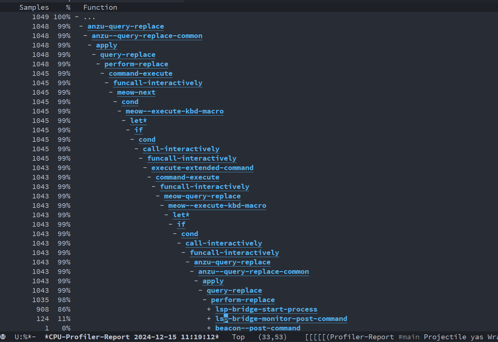

# 记一次emacs输入卡顿分析

[TOC]

[TAG:emacs,performance]
[TIME:2024-12-15]

## 问题
最近想把博客重新捡起来，参考了[Bot-man](https://bot-man-jl.github.io/)的博客, 进行了一点调整。放弃了之前用的emacs里的[org mode](https://orgmode.org/)来写，转投markdown。配置好github page作为博客后，顺带把之前的emacs的配置再捡起来，使用emacs来写，把emacs里书写需要的一些功能配置成快捷键，可以极大地方便操作。

在拉取我之前的emacs配置之后，尝试使用emacs社区里看到的一种有别于evil模式的模态编辑:[meow](https://github.com/meow-edit/meow),称为猫态编辑；可以使用它来替换掉evil mode（我主要使用evil默认的键位）以及[general](https://github.com/noctuid/general.el)（方便地定义一组快捷键).

还没怎么修改，发现在emacs里的光标移动非常卡顿，一直按着下键，emacs能直接卡住不动好一会...受不了了。

## 排查 
拿wpr录制下trace，看看emacs的主线程发生了什么.我的电脑是12核24线程的cpu，下图中可以看到emacs的进程中主要运行的主要逻辑就是主线程跑的，且这个进程占用cpu达到4.1%(100/24~= 4.16),说明基本上emacs的UI主线程已经基本上打满了。这肯定会让我的操作变卡。

找了一圈，没有找到emacs这个gnu软件的符号在哪里，比较尴尬；但是看堆栈里除了emacs.exe的逻辑，还有个**simple-fab5b0cf-7c10fc4e.eln**的逻辑（截图高亮区域），怀疑是什么第三方的插件代码引起的？这里eln结尾说明是elisp代码编译后的native字节码；一搜发现不是，是emacs自带的一些包括文件处理之类的基础逻辑库。

这么看应该是emacs自身elisp执行的逻辑里存在问题，想到emacs自身也有profiling机制，我们执行**profile-start** ,性能选项选择cpu，然后上下移动光标触发卡顿现象，然后再 **profile-stop** , **profile-report** 。可以看到输出的cpu堆栈情况如下,

主要逻辑是卡在lsp-bridge这个插件的函数中，profile期间88%的cpu占用是在跑`lsp-bridge-start-process` 这个函数；这个lsp-bridge 本身是用来做代码补全的插件，会启独立的server进程来做一些代码补全相关的支持；

比较奇怪，我们只是按了j键移动光标,为什么会走到这个逻辑呢, 而且它的上层调用还是`query-replace`这种普通的查找替换逻辑；使用`debug-on-entry`在这个函数下断点调试，观察下情况，下完断点之后发现马上就断住了。d 单步执行，又会进入下一个`lsp-bridge-start-process`，如此每次都是，而且现在它的上层调用是 recursive-edit，还不一样，它的调用时机非常可疑。

这么看`lsp-bridge-start-process`这个调用可能存在配置上逻辑的异常，在配置路径下搜索这个`start-process`相关的配置。

发现这个调用被加到了[post-command-hook](https://www.gnu.org/software/emacs/manual/html_node/elisp/Command-Overview.html#index-post_002dcommand_002dhook) 中,本意看提交记录是想确保这里的逻辑能被调用成功(server启动成功之后会移除该hook),但是这里的策略非常激进，因为这个hook的场景是每次执行command都会跑一次这里注册的逻辑；如果这里`lsp-bridge-start-process`的逻辑一直不成功，就可能频繁触发。此时我们再看 **Lsp Bridge** buffer里是否有什么错误信息,发现其服务进程存在频繁异常退出的情况。

至此，搞清楚了原因:是`lsp-bridge-start-process`注册为post-command-hook 之后，由于python依赖异常，每次这个lsp-bridge的逻辑都无法执行成功，进程异常退出，然后由于hook继续频繁触发该调用逻辑引起了卡顿。

针对这个情况,先把lsp bridge 相关的配置去掉,之后重启emacs发现果然恢复了流畅操作。
