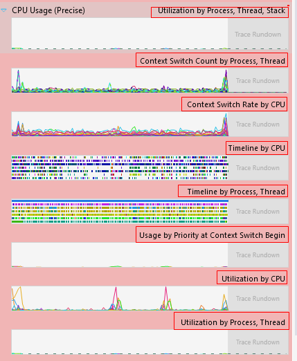

# learn ecs

[TOC]

[TIME:2025-05-11]
[TAG:ecs,game_engine,bevy]


## 前言
在前一段时间"网上冲浪"的时候，了解到rust语言的发展历程，大为震撼，激发了我对rust的学习热情，它从语言设计上就把 C++中相对隐晦的对象生命周期问题明晃晃得摆出来，明确对象生命周期，然后借助编译器的检查，规避很多的生命周期管理问题，本质上来说解决了C++的一大痛点，但同时也提高了学习门槛。

了解rust的过程中，发现了一个叫[bevy](https://bevyengine.org/)的游戏引擎，这个引擎有个非常有意思的特点 -- "数据驱动"。简单来说，所有在游戏中存在的事物都是组合起来的数据，另外存在作用于这些数据的系统，构成了整个游戏世界。这里实现的核心，在于本文想介绍的ECS (实体、组件、系统)编程范式。


## ECS
区别于面向对象编程，ECS遵循"组合优于继承"的原则。没有继承关系，只有组合。分成下面三个模块：

* 实体(Entity): 每个实体就是一个唯一的ID, 它对应由若干个组件构成。
* 组件(Component): 存在多类组件，构成实体。
* 系统(System): 作用于实体或者组件上的规则逻辑，


一个bevy实现的基础逻辑：

``` rust 
use bevy::prelude::*;

#[derive(Component)]
struct Person;

#[derive(Component)]
struct Name(String);

#[derive(Component)]
struct Flag;

// 创建三个实体
fn add_people(mut commands: Commands) {
    commands.spawn((Person, Name("Name1".to_string())));
    commands.spawn((Person, Flag, Name("Name2".to_string())));
    commands.spawn((Person, Name("Name3".to_string())));
}

// 过滤出带Person Component的实体，打印
fn greet_people(query: Query<&Name, With<Person>>) {
    for name in &query {
        println!("hello {}!", name.0);
    }
}

// 过滤出带Flag Component的实体，打印
fn greet_flag_people(query: Query<&Name, With<Flag>>) {
    for name in &query {
        println!("hello people with flag: {}!", name.0);
    }
}

// 遍历所有带Person Component的实体,遍历更新名字
fn update_people(mut query: Query<&mut Name, With<Person>>) {
    for mut name in &mut query {
        if name.0 == "Name1" {
            name.0 = "Name100".to_string();
            break; // We don't need to change any other names.
        }
    }
}
fn main() {
    App::new()
        .add_systems(Startup, add_people)
        .add_systems(
            Update,
            ((update_people, greet_people, greet_flag_people).chain(),),
        )
        .run();
}

```

输出如下

``` src
hello Name100!
hello Name3!
hello Name2!
hello people with flag: Name2!
```
对于一个简单的打印操作，区别于OOP逐个遍历操作对象，ECS通过把需要打印的实体过滤出来，通过System进行打印。


## 优点 
* 扩展性强：处理逻辑和数据的分离，使得可以更方便得对整个系统的逻辑进行增删。设想一个应用程序，通过增减System处理逻辑，就可以实现想要的逻辑调整；这赋予了程序极大的可扩展性。

整个程序可以简化成下面这种的结构: 

``` rust
App.GenerateEntities().Add([System1, System2, System3 ...]).Run() 
```

* 优雅(主观)：人类社会也可以简化为一个ECS系统，每个个体有自身的属性、组件，社会的道德、法治规则、经济规律（这些系统）作用到每个人的身上;相比OOP，可以更直观得模拟、表现这个社会。

## 联想
Windows系统Trace的数据处理中，不同的聚类方式，即可从不同维度去分析查看数据;和ECS模式有一些相似的地方。正是这种数据和逻辑的分离，给Trace数据非常多的聚类分析视角，极大得增强了分析的灵活性。



发现网上有个这样的对比OOP和ECS的例子：oop的思路是“我是什么”；ecs的思路是“我有什么”。

OOP："我"是一个戴眼镜的人，所以我有一副眼镜(Property)，我会擦眼镜("我"的Function之一）。我.眼镜=true。我.擦眼镜()。

ECS："我"有一副眼镜(Component)。所以我可以是一个戴眼镜的人(检查是否是戴眼镜的人的System)，我也会擦眼镜(擦眼镜System)。这两个System都关心所有有眼镜的entity。

主要区别就在于“继承”和“组合”，两者的实现思路截然不同。OOP是针对对象，ECS的System逻辑是针对一类实体，而且需要做更高层次的抽象，抽象出一类实体的通用逻辑规则。