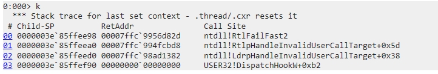

# LdrpHandleInvalidUserCallTarget 崩溃

[TOC]

[TIME:2025-02-20]
[TAG:crash]

## 问题
crash minidump：
[link](invalid_target_crash/crash.dmp)

崩溃堆栈如下：

## 分析
崩在系统ntdll逻辑中，看着函数名有InvalidUserCallTarget，猜测可能系统存在什么校验逻辑，校验出错然后fastfail退出的。

网上查询 LdrpHandleInvalidUserCallTarget相关的问题，发现有一例类似的崩溃堆栈分析，
https://devblogs.microsoft.com/oldnewthing/20240913-00/?p=110257
触发崩溃的Rtlp­Handle­Invalid­User­Call­Target 调用是微软系统提供的[控制流防护](https://learn.microsoft.com/zh-cn/windows/win32/secbp/control-flow-guard)机制，用于校验调用的函数指针是否是一个有效的函数指针。此处很可能是调用的函数指针不合法了，然后导致了问题。查询网上的分析中，从寄存器里直接找到了可疑的指针地址，我们也来看下我们的场景：
发现这里的00007ffc740f1b20 地址存在于rbx，rdx 和rbp中，较为可疑

尝试解析这个地址，发现果然存在问题，是flhhlp.dll 引入，且该dll已经卸载了，这个地址确实是个无效地址。

基于此，我们可能已经找到了问题原因，那就是这个flhhlp.dll（其他软件引入）注入到进程中，自身存在逻辑异常，在dll卸载之后仍然存在野指针使用。

进一步分析反汇编的逻辑，确认这里寄存器数值和实际Rtlp­Handle­Invalid­User­Call­Target 传入参数之间的关系；毕竟最终导致退出的调用是FastFail。

64位程序中，rcx,rdx,r8,r9 分别对应函数调用的前四个参数；rax作为返回值

下图中LdrpHandleInvalidUserCallTarget的调用中，可知rcx应该设置的是需要校验的函数地址，之后调用 Rtlp­Handle­Invalid­User­Call­Target 函数，

在Rtlp­Handle­Invalid­User­Call­Target  函数内，将rcx赋值给了rbx，之后直到FastFail退出，rbx的值没有被修改，且fastfail之前rbx赋值给了rdx。

RtlFailFast2 本身是直接触发了中断然后退出了，也没有修改寄存器的操作。

此时再回头看寄存器的数值，可知rbx和rdx对应的值实际都是对应校验的函数地址（且两者确实一致）；至此，可以确认就是00007ffc740f1b20 地址对应的flhhlp.dll 引起的问题。

## 引用
### 反汇编逻辑查看
分析过程中，使用反汇编软件 [Ghidra](https://github.com/NationalSecurityAgency/ghidra)，对该ntdll进行反汇编，查看反汇编中的函数逻辑，帮助我们进一步理解系统调用的逻辑。

### 64位和32位一般的寄存器传参情况

x86调用约定：https://zh.wikipedia.org/wiki/X86%E8%B0%83%E7%94%A8%E7%BA%A6%E5%AE%9A

#### msvc

32位：有不同的调用约定，基本是从右向左通过栈传递

64位：前四个参数, rcx, rdx, r8,r9，额外参数通过栈传递

#### x86-64 clang 19.1.0
64位: 前6个参数，rdi, rsi, rdx, rcx, r8, r9。

#### armv8-a clang 19.1.0
64位: 前8个参数，x0-x7。

